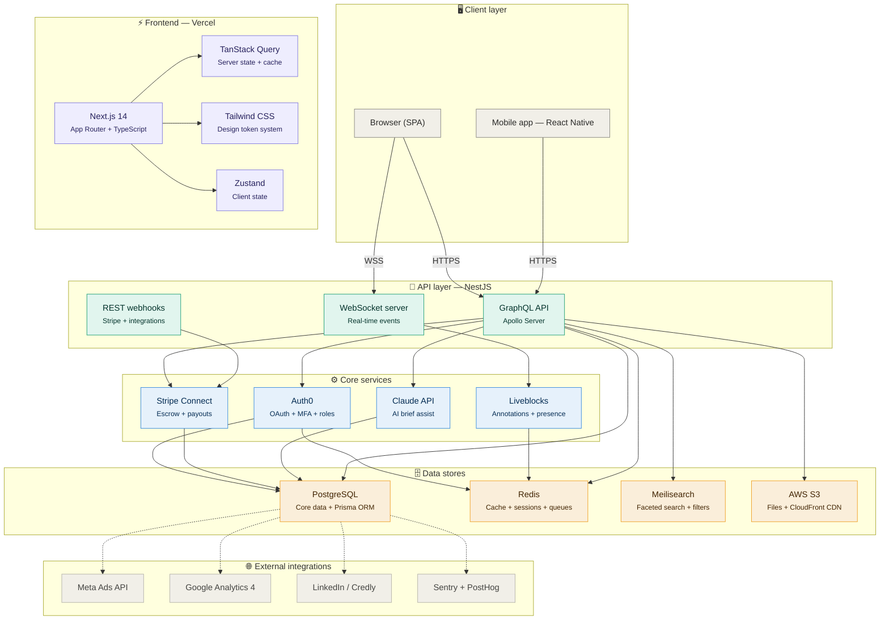
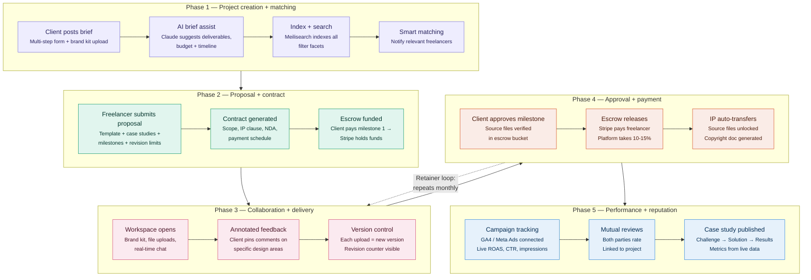

This is a [Next.js](https://nextjs.org) project bootstrapped with [`create-next-app`](https://nextjs.org/docs/app/api-reference/cli/create-next-app).

# Editorial Marketplace — Technical Architecture

> A curated marketplace connecting elite marketing & design freelancers with agencies and brands that demand excellence.

---

## System Architecture



---

## Core Data Flow — Project Lifecycle



---

## Tech Stack Summary

| Layer | Technology | Purpose |
|-------|-----------|---------|
| **Frontend** | Next.js 14, TypeScript, Tailwind CSS | App shell, SSR, design system |
| **State** | TanStack Query, Zustand | Server + client state management |
| **API** | NestJS, Apollo GraphQL, WebSockets | Unified API layer + real-time |
| **Auth** | Auth0 | OAuth, MFA, role-based access |
| **Payments** | Stripe Connect (Custom) | Escrow, milestones, retainer billing |
| **Real-time** | Liveblocks | Annotations, presence, collaboration |
| **AI** | Claude API (Anthropic) | Smart brief assist, matching |
| **Database** | PostgreSQL + Prisma | Core relational data |
| **Cache** | Redis | Sessions, queues, rate limiting |
| **Search** | Meilisearch | Faceted filtering, full-text search |
| **Storage** | AWS S3 + CloudFront | Design files, media, CDN delivery |
| **Monitoring** | Sentry, PostHog | Error tracking, product analytics |
| **Hosting** | Vercel (frontend), AWS ECS (backend) | Edge deployment, container orchestration |

---

## Security

- **Authentication**: Auth0 with OAuth 2.0, MFA, email verification
- **Authorization**: Role-based (Client, Freelancer, Admin) with row-level security
- **API**: JWT with short expiration + refresh token rotation, rate limiting via Redis
- **Payments**: PCI compliance via Stripe (no raw card data touches our servers)
- **Files**: S3 signed URLs with expiration, MIME type validation, malware scanning
- **Encryption**: AES-256 at rest for sensitive data (contracts, NDAs, financials)
- **Headers**: Helmet.js for CSP, HSTS, X-Frame-Options
- **IP Escrow**: Source files stored in isolated S3 bucket, unlocked only on payment release

---

## Build Phases

**Phase 1 — MVP** (Months 1-3)
Auth + profiles + portfolios + project posting + basic search/filters + Stripe escrow

**Phase 2 — Collaboration** (Months 4-5)
Workspace + annotated feedback + version control + brand kit + chat

**Phase 3 — Intelligence** (Months 6-7)
AI brief assist + smart matching + performance dashboard + analytics integrations

**Phase 4 — Scale** (Months 8+)
Template marketplace + team assembly + mobile app + advanced IP automation

## Getting Started

First, run the development server:

```bash
npm run dev
# or
yarn dev
# or
pnpm dev
# or
bun dev
```

Open [http://localhost:3000](http://localhost:3000) with your browser to see the result.

You can start editing the page by modifying `app/page.tsx`. The page auto-updates as you edit the file.

This project uses [`next/font`](https://nextjs.org/docs/app/building-your-application/optimizing/fonts) to automatically optimize and load [Geist](https://vercel.com/font), a new font family for Vercel.

## Learn More

To learn more about Next.js, take a look at the following resources:

- [Next.js Documentation](https://nextjs.org/docs) - learn about Next.js features and API.
- [Learn Next.js](https://nextjs.org/learn) - an interactive Next.js tutorial.

You can check out [the Next.js GitHub repository](https://github.com/vercel/next.js) - your feedback and contributions are welcome!

## Deploy on Vercel

The easiest way to deploy your Next.js app is to use the [Vercel Platform](https://vercel.com/new?utm_medium=default-template&filter=next.js&utm_source=create-next-app&utm_campaign=create-next-app-readme) from the creators of Next.js.

Check out our [Next.js deployment documentation](https://nextjs.org/docs/app/building-your-application/deploying) for more details.
